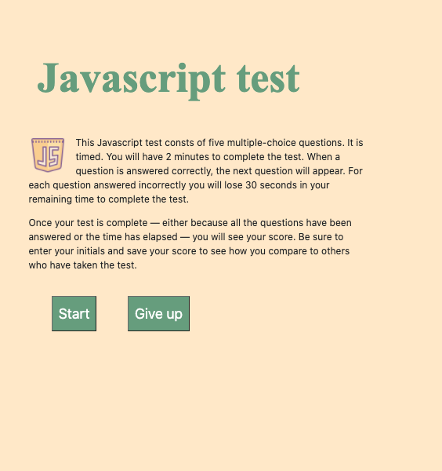

# Javascript quiz

This project is a front-end web application that presents the user with a series of multiple choice questions about the basics of Javascript.

## Description

The application uses Javascript to dynamically update html and CSS code as the user progresses through the test.

Once the test is complete, or if the users quits the test in progress, the user is presented with his or her score and the score can be saved in local memory.

## Installation

In order to run the application, simply navigate to https://nmiller2379.github.io/js-test/.

## Challenges

I was unable to get the timing to work for each test question, nor was I able to get the local storage to work.
